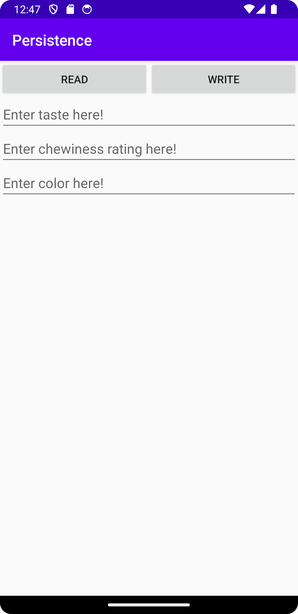
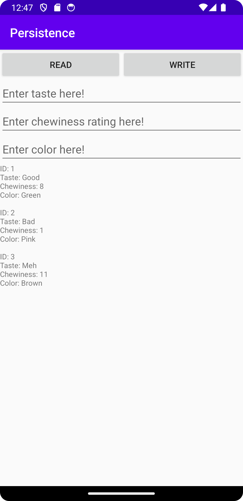

# Rapport

Jag har skapat en databas som lagrar information of 'chewingGums'. Du kan skriva in taste,
chewiness och color i 3 fält. När du klickar på Write så kallas writeChewingGumData metoden
som tar datan från de 3 fälten och lägger den i 3 variabler. Metoden kontrollerar så fälten inte är tomma
och skickar sedan variablerna till DatabaseHelper klassen som sedan lägger in variablerna i databasen i varsinn kolumn.
Jag har även skapat en ChewingGum klass och en DatabaseTables klass. ChewingGum klassen innehåller endast de
attributer som sparas (tase, chewiness, color) och getters. DatabaseTables används inte mycket förutom
när en tabell ska skapas eller tas bort, vilket inte ska behövas förutom 1 gång när den skapas.

## Följande grundsyn gäller dugga-svar:

- Ett kortfattat svar är att föredra. Svar som är längre än en sida text (skärmdumpar och programkod exkluderat) är onödigt långt.
- Svaret skall ha minst en snutt programkod.
- Svaret skall inkludera en kort övergripande förklarande text som redogör för vad respektive snutt programkod gör eller som svarar på annan teorifråga.
- Svaret skall ha minst en skärmdump. Skärmdumpar skall illustrera exekvering av relevant programkod. Eventuell text i skärmdumpar måste vara läsbar.
- I de fall detta efterfrågas, dela upp delar av ditt svar i för- och nackdelar. Dina för- respektive nackdelar skall vara i form av punktlistor med kortare stycken (3-4 meningar).

Programkod ska se ut som exemplet nedan. Koden måste vara korrekt indenterad då den blir lättare att läsa vilket gör det lättare att hitta syntaktiska fel.

```
    private void writeChewingGumData() {
        EditText editTextTaste = findViewById(R.id.editTextTaste);
        EditText editTextChewiness = findViewById(R.id.editTextChewiness);
        EditText editTextColor = findViewById(R.id.editTextColor);

        String taste = editTextTaste.getText().toString().trim();
        String chewiness = editTextChewiness.getText().toString().trim();
        String color = editTextColor.getText().toString().trim();

        // Check if any field is empty
        if (taste.isEmpty() || color.isEmpty() || chewiness.isEmpty()) {
            if (taste.isEmpty()) {
                editTextTaste.setError("Please enter taste");
            }
            if (color.isEmpty()) {
                editTextColor.setError("Please enter color");
            }
            if (chewiness.isEmpty()) {
                editTextChewiness.setError("Please enter chewiness");
            }
            return;
        }

        // Add data
        databaseHelper.addChewingGum(taste, Integer.parseInt(chewiness), color);

        // Clear fields
        editTextTaste.setText("");
        editTextChewiness.setText("");
        editTextColor.setText("");

        // Data added successfully
        Toast.makeText(this, "Chewing gum data added successfully", Toast.LENGTH_SHORT).show();
    }
```


